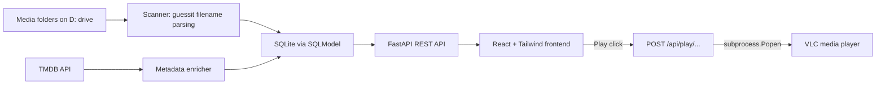

# VLCouch - Implementation Plan

Greenfield project (workspace currently contains only [Readme.md](Readme.md)). Confirmed decisions from prior discussion: Python/FastAPI backend, simple VLC subprocess launch (no HTTP resume tracking yet), TMDB for metadata.

## Architecture overview



The backend is a single FastAPI process that both serves the REST API and (in production) the built frontend static files, so the whole app is one process on `localhost:PORT`.

## Repository layout

```
vlcouch/
  backend/
    app/
      main.py          # FastAPI app, mounts routers + static frontend build
      config.py        # loads .env: media roots, TMDB_API_KEY, VLC_PATH
      db.py            # SQLModel engine/session, creates tables on startup
      models.py        # Movie, Show, Episode, WatchProgress
      scanner.py       # walks media roots, runs guessit, populates DB
      tmdb.py          # TMDB search/match/poster download client
      vlc.py           # locates vlc.exe, launches subprocess
      routers/
        library.py     # GET movies/shows/show detail/continue-watching
        play.py         # POST play/{type}/{id}
        watch.py         # POST watch-status/{type}/{id}
    requirements.txt
    data/               # gitignored: library.db, posters/
  frontend/
    src/
      main.jsx
      App.jsx
      components/PosterCard.jsx, Row.jsx
      pages/Home.jsx, ShowDetail.jsx
    index.html, package.json, tailwind.config.js
  .env.example
  .gitignore
  Readme.md
```

## Phase 1: Project scaffolding

- Initialize `backend/` as a Python venv project with `requirements.txt`: `fastapi`, `uvicorn`, `sqlmodel`, `guessit`, `httpx`, `python-dotenv`.
- `backend/app/config.py` loads settings from `.env`: `MEDIA_ROOTS` (JSON list of `{path, type}`, type = `movies`|`tv`), `TMDB_API_KEY`, `VLC_PATH` (optional override).
- `backend/app/db.py` + `backend/app/models.py`: SQLModel models `Movie`, `Show`, `Episode`, `WatchProgress`. No migration framework for this personal-scale app — schema changes just mean deleting `library.db` and rescanning.
- `backend/app/main.py`: create FastAPI app, run `create_all` on startup, mount routers, mount `frontend/dist` as static files for production.
- Scaffold `frontend/` with Vite + React (plain JavaScript, no TypeScript, per the "keep it simple" preference) and Tailwind CSS.
- `.env.example` documenting the three settings above; `.gitignore` for `backend/data/`, `frontend/dist/`, `node_modules/`, `.env`, `__pycache__`.
- A `dev.ps1` helper script (PowerShell, matches your shell) to launch backend (`uvicorn --reload`) and frontend (`npm run dev`) concurrently for local development.

## Phase 2: Library scanner

- `backend/app/scanner.py`: for each configured root, walk all video files (`.mp4`, `.mkv`, `.avi`, etc.).
  - `type == "movies"`: run `guessit` on the filename to get title/year; upsert into `Movie` keyed by `file_path` (unique), dedupes on rescan.
  - `type == "tv"`: run `guessit` to get show title/season/episode; find-or-create `Show` by normalized title, then upsert `Episode` linked to that show, keyed by `file_path`.
  - Subtitle detection: look for a sibling file with the same base name and `.srt`/`.ass`/`.vtt` extension, and common `Subs/` subfolders; store matched path on the `Movie`/`Episode` row.
- Expose `POST /api/scan` (runs via `BackgroundTasks` so the request returns immediately) and also trigger a scan automatically on app startup.

## Phase 3: TMDB enrichment

- `backend/app/tmdb.py`: thin `httpx` client for TMDB `/search/movie` and `/search/tv`.
- After the scanner creates a `Show`/`Movie` without a `tmdb_id`, search TMDB with the parsed title (+ year for movies), take the best match, and store `tmdb_id`, `overview`, and a locally downloaded poster (cached under `backend/data/posters/`) so repeat scans don't re-hit the API.
- No match found -> leave poster/overview null; frontend renders a placeholder card instead of erroring.

## Phase 4: Browse UI

- API: `GET /api/movies`, `GET /api/shows`, `GET /api/shows/{id}` (seasons + episodes), `GET /api/continue-watching`.
- Frontend `Home` page: horizontal poster rows ("Continue Watching", "Movies", "Shows") using TMDB poster images, dark theme, hover-scale cards via Tailwind.
- `ShowDetail` page: season/episode list with per-episode Play button and watched checkbox; highlights the "up next" (first unwatched) episode.

## Phase 5: Play action (VLC handoff)

- `backend/app/vlc.py`: locate `vlc.exe` via `VLC_PATH` env override, falling back to checking the Windows registry (`SOFTWARE\VideoLAN\VLC`) and default `Program Files` install paths.
- `POST /api/play/{item_type}/{id}`: resolve the file path (+ subtitle path if present), launch `subprocess.Popen([vlc_path, file_path, f"--sub-file={subtitle_path}"])` detached from the server process, return success immediately (fire-and-forget — no in-app playback UI).

## Phase 6: Manual watch tracking ("continue watching")

- `WatchProgress` table: `item_type`, `item_id`, `watched: bool`, `last_watched_at`.
- `POST /api/watch-status/{item_type}/{id}` toggles watched state.
- `GET /api/continue-watching` returns shows with some-but-not-all episodes watched, ordered by `last_watched_at`.
- Frontend: checkbox per episode row updates watched state and refreshes the Continue Watching row.

## Deferred / future enhancements (not in this pass)

- Swap manual watched-marking for automatic resume tracking via VLC's HTTP interface (poll playback position, auto-seek on relaunch) — the "smarter" option we intentionally deferred.
- Filesystem watcher (chokidar/watchdog-style) instead of manual rescan.
- In-app settings page for editing media roots / API key instead of hand-editing `.env`.
